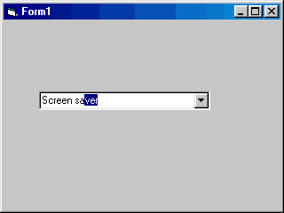

<div align="center">

## AutoComplete


</div>

### Description

Add the Internet Explorer 4 AutoComplete effect to a common combo box
 
### More Info
 
Add a combo box called Combo1 to a form and set Sorted=True in the properties box (very important!!!)


<span>             |<span>
---                |---
**Submitted On**   |
**By**             |[Henrik Ruud](https://github.com/Planet-Source-Code/PSCIndex/blob/master/ByAuthor/henrik-ruud.md)
**Level**          |Intermediate
**User Rating**    |4.5 (18 globes from 4 users)
**Compatibility**  |VB 6\.0
**Category**       |[Miscellaneous](https://github.com/Planet-Source-Code/PSCIndex/blob/master/ByCategory/miscellaneous__1-1.md)
**World**          |[Visual Basic](https://github.com/Planet-Source-Code/PSCIndex/blob/master/ByWorld/visual-basic.md)
**Archive File**   |[](https://github.com/Planet-Source-Code/henrik-ruud-autocomplete__1-11652/archive/master.zip)

### API Declarations

```
Global RealLen As Byte
Global AutoInput As Boolean
```


### Source Code

```
Private Sub Form_Load()
  Combo1.AddItem "Computer"
  Combo1.AddItem "Screen"
  Combo1.AddItem "Screen saver"
  Combo1.AddItem "Printer"
  Combo1.AddItem "Printer cartridge"
  Combo1.AddItem "Printer cable"
  Combo1.AddItem "Modem"
  Combo1.AddItem "Speakers"
  Combo1.AddItem "Keyboard"
  Combo1.AddItem "Mouse"
  Combo1.AddItem "Floppy disks"
  Combo1.AddItem "Floppy disk drive"
  Combo1.AddItem "Compact disk"
  Combo1.AddItem "Hard drive"
  Combo1.AddItem "Hardware"
  Combo1.AddItem "Software"
  Combo1.AddItem "Motherboard"
  Combo1.AddItem "Sound card"
  Combo1.AddItem "Webcam"
  Combo1.AddItem "Joystick"
  Combo1.AddItem "Mouse pad"
  Combo1.AddItem "Laser printer"
  Combo1.AddItem "Network card"
  Combo1.AddItem "ISDN card"
  Combo1.AddItem "HUB"
  Combo1.Text = ""
  AutoInput = False
End Sub
Private Sub Combo1_Change()
  Dim i As Integer
  If Combo1.Text <> "" And AutoInput = False Then
    RealLen = Len(Combo1.Text)
    Do
      If LCase(Combo1.Text) = LCase(Combo1.List(i)) Then
        Exit Sub
      ElseIf LCase(Combo1.Text) = LCase(Left(Combo1.List(i), RealLen)) Then
        AutoInput = True
        Combo1.Text = Combo1.List(i)
        Combo1.SelStart = RealLen
        Combo1.SelLength = Len(Combo1.Text) - RealLen
      End If
    i = i + 1
    Loop Until i = Combo1.ListCount
  Else
    AutoInput = False
  End If
End Sub
Private Sub Combo1_KeyDown(KeyCode As Integer, Shift As Integer)
  If KeyCode = 8 Then
    If RealLen > 0 And Combo1.SelLength > 0 Then
      Combo1.SelStart = RealLen - 1
      Combo1.SelLength = Len(Combo1.Text) - RealLen + 1
    End If
  ElseIf KeyCode = 46 Then
    If Combo1.SelLength <> 0 Then
      Combo1.Text = Left(Combo1.Text, RealLen)
      AutoInput = True
    End If
  End If
End Sub
```

